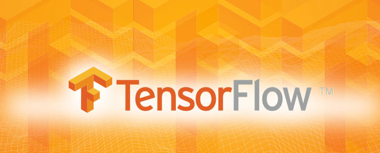
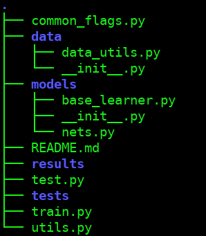

# rpg\_tensorflow\_base
### A template to train and test your machine learning models in tensorflow



While there are plenty of very nice libraries to provide high-level API for
implementing deep neural networks models, e.g. [Keras](https://keras.io/) or [TFlearn](http://tflearn.org/), this repo
attempts to facilitate the use of the fast and pure tensorflow API.

In particular, this repo provides a template for any machine model you want
to develop. It has been written with the following goals in mind:

1. Summarize and deploy all the recommendations coming from the [TF community](https://www.tensorflow.org/performance/performance_guide)
2. Make effort-free the use of [Tensorboard](https://www.tensorflow.org/get_started/summaries_and_tensorboard) (for baby-sitting the learning process) and [Checkpoints](https://www.tensorflow.org/programmers_guide/variables) (to restore training or do testing) 
3. Build a basic file structure that follows some basic good practices (the best I discovered up to now)

## Table of Contents

* [What do you usually need to do when coding a deep learning system?](#what-do-you-usually-need-to-do-when-coding-a-deep-learning-system)
* [What should you do to successfully train your network?](#what-should-you-do-to-successfully-train-your-network)
* [In what does this repo helps me with building a tensorflow model?](#in-what-does-this-repo-helps-me-with-building-a-tensorflow-model)
* [Minimal requirements](#minimal-requirements)
* [What should I do after cloning the repo?](#what-should-i-do-after-cloning-the-repo)
  * [Getting started](#getting-started)
* [The overall folder architecture](#the-overall-folder-architecture)
* [Dependencies](#dependencies)

## What do you usually need to do when coding a deep learning system?

1. You will have to code the network you want to use
2. This model will have (at least) two different stages: training stage and inferring stage (for validation or testing)
3. You will have to feed a dataset to this model (training stage)
4. You might have to feed it single elements too (when, for example, deploying it on a robotic platform)
5. You will have to tune its hyper-parameters

## What should you do to successfully train your network?

1. You will need to periodically plot some evaluation metrics (e.g. loss or accuracy), in training AND testing phase
2. You will need a nice folder architecture for training results or tests (so you can skim through it and remember each experiment easily)
3. You want to be able to replicate any experiment you do
4. You want to be able to restore the training in case something goes bad (e.g. blackout)

## In what does this repo helps me with building a tensorflow model?

1. The basic folder structure and key files are already written for you
2. It maximizes the usage of your GPU power thanks to the multi-threaded reading
3. It helps you using tensorboard logs to baby-sit your training process

## Minimal requirements

If this is the first time you write a deep learning model, maybe this is not the right place to start. Try to get a bit more familiar
with tensorflow notations using [tutorials](https://www.tensorflow.org/get_started/mnist/beginners), and try to also have a look at some [Keras tutorials](https://keras.io/getting-started/sequential-model-guide/#examples).
You should be able to understand the following terms before starting:

1. Placeholders
2. Operations and Tensors
3. [Input queues](https://blog.metaflow.fr/tensorflow-how-to-optimise-your-input-pipeline-with-queues-and-multi-threading-e7c3874157e0) (they are already coded for you, but might be a good idea to know what they are)
4. Difference between graph creation and graph evaluation
5. Supervised / Unsupervised Learning


## What should I do after cloning the repo?

The code in this repository is written for a simple 5 class classification problem. There is already a small [sample dataset](./data/sample_data) to
test if everything is working properly. In case you are dealing with a supervised learning problem (classification / regression),
it is a good idea to imitate the folder structure of the sample dataset to build your own dataset.
Indeed, minimal changes to the code will be required to build your model.

### Getting started

To start training the sample classification problem with the provided dataset, use the following command:

```
python3 train.py --train_dir=./data/sample_data/training --val_dir=./data/sample_data/testing --summary_freq=20 --checkpoint_dir=./tests/test_0 --save_freq=5
```

After a few epochs, try to stop it. Later, you can continue training from your last checkpoint with this command:

```
python3 train.py --train_dir=./data/sample_data/training --summary_freq=20 --checkpoint_dir=./tests/test_0 --resume_train=True --val_dir=./data/sample_data/testing
```

To check over your training process, you can use [Tensorboard](https://www.tensorflow.org/get_started/summaries_and_tensorboard). To do it, use the following:

```
tensorboard --logdir=./tests/test_0
```

Be sure there is a single events file in the `logdir` (otherwise you will see some mixed output). Then open the link you will be given in a browser and have a look at the logs.

Now again stop training and test the model you learned. 

```
python test.py --test_dir=./data/sample_data/testing --ckpt_file=./tests/test_0/model-#
```

In the last command, `#` is the checkpoint number you want to evaluate. Have a look at the folder `tests/test_0` to see which ones are available.
It's a good idea to test it on the train and test dataset, to see if everything is as expected.
During training, the `val_dir` will be your validation directory, used to benchmark your model while training. Don't forget to put this parameter, it won't work otherwise.
Overall, a model will be saved every `save_freq' epochs. Additionally, the model with best validation loss will be also saved.
Have a look at [common_flags.py](./common_flags) to see what are the available training options.

After adapting the code to your problem, and prepared your dataset, you should be able to train and test using exactly the same commands. The following section gives more details about the file structure and what to change to prepare and run your model.

## The overall folder architecture



[__models__](/models): This is the folder containing the deep learning module and the deep neural networks implementations. In particular, [base_learner.py](./models/base_learner.py)
implements the class `Learner` that you should use for training and testing. You should change this class to your needs. There are comments, where
you need to make changes. At high level, you should just define how to compute the loss given network predictions, and what things to log to
tensorboard. Moreover, the file [nets.py](./models/nets.py) should contain the neural network you want to use to make predictions. You can use any high level
API, like Keras, to build it. There are few examples on how to do it!

[__data__](./data): This is the base folder for I/0. In here should go your script to load all filenames (and optionally the labels) of your data. Note
that you will load the data __during__ training, not before it! This allows to scale very well to large datasets, that might not fit in memory.
Additionally you need to be able to load batches of images at test/validation time. Have a look at the file [data_utils.py](data/utils/data_utils.py) to have an example on how to do it.

__results__ and __tests__ : Self-explanatory, they should contain the outputs and checkpoints of your tests and results.

[__train.py__](./train.py): Main function to start the training. For most use cases, you won't need to change this function.

[__test.py__](./test.py): Main testing function. You might need some little adaptation to output the results of your trained models.

[__utils.py__](./utils.py): Utility script, contains some general functions to automate testing or some other useful API.

[__common_flags.py__](./common_flags.py): Script containing all flags you want to use to set up your training and testing model.

## Dependencies

This library has the following dependencies:

0. Python (3.n versions are better)
1. [Tensorflow](https://www.tensorflow.org/install/)
2. Keras, ```sudo pip install keras```
3. numpy, ```sudo pip install numpy```
4. gflags, ```sudo pip install python-gflags ```

Additionally, you might need to use OpenCV (```sudo pip install opencv-python```) to load images at test time (as it is done in the example). In case you have problems for this library,
like conflict with your catkin-opencv, try to update your `PYTHONPATH' so that the system does not see catkin-opencv. If you are desperate or don't want
to mess up with your OpenCv, just use an other image loader, e.g. Pillow.
